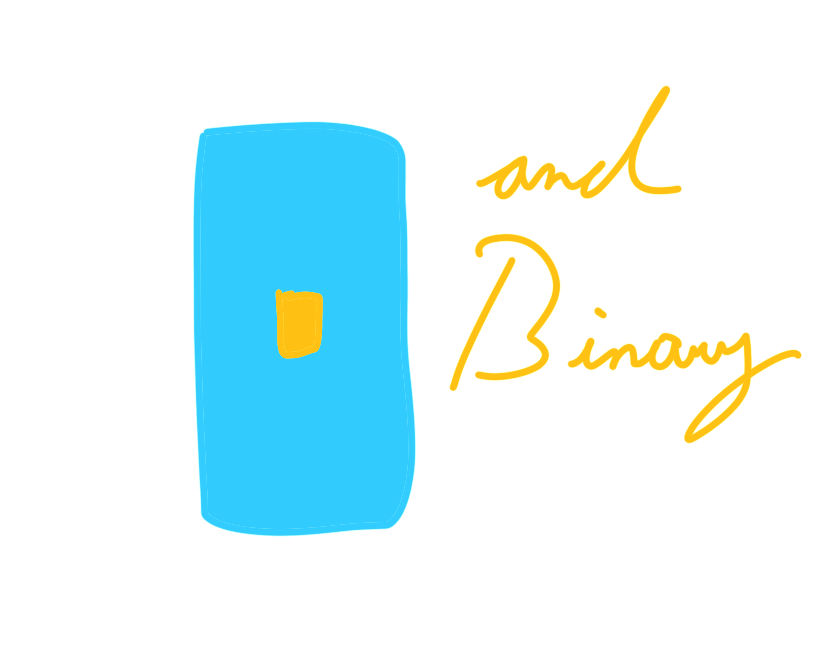
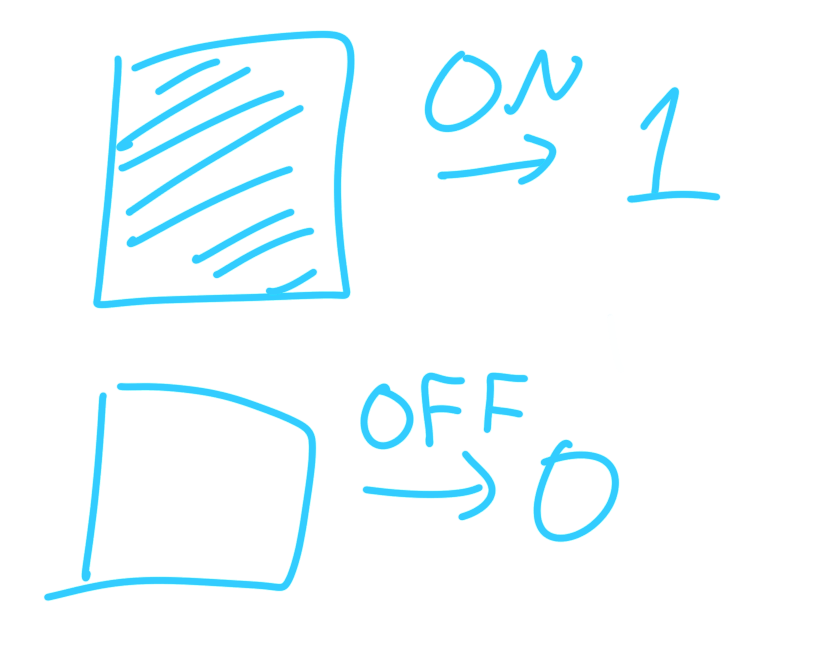
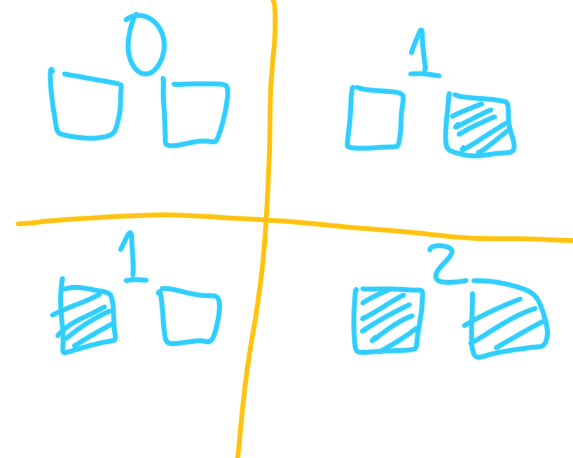
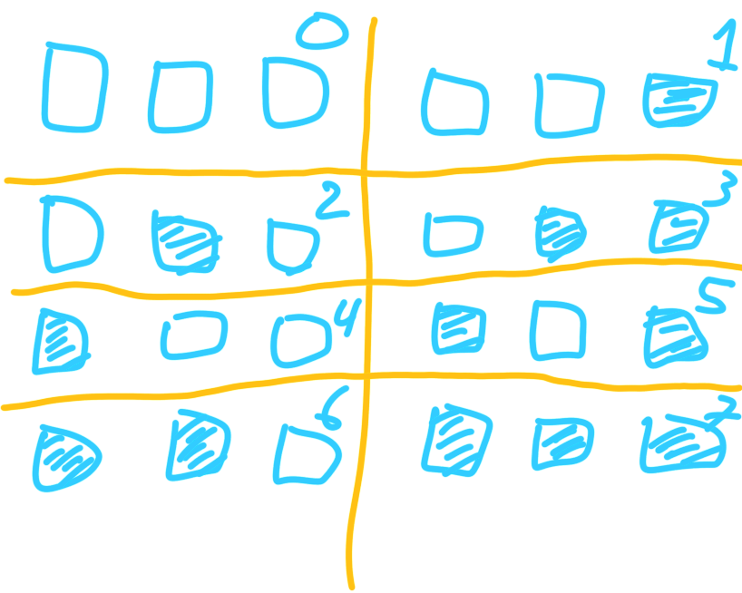
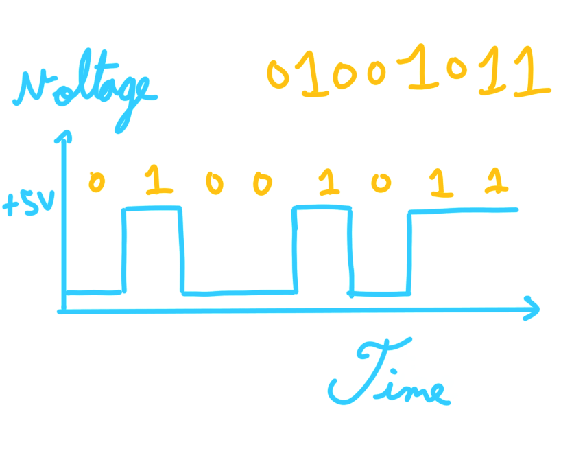

<figcaption>Author: Amr Ojjeh</figcaption>
<figcaption>Cover By: Amr Ojjeh</figcaption>
<figcaption>Last updated: August 17, 2021</figcaption>

# Counting With Light Switches

People are familiar counting with their two hands. However, how is a computer able to count using electricity?

Suppose for one second that you had a single light switch. Light switches can only be in two states, either on or off. You could say, that when the light switch is off, that signifies the number 0. When it is on, it represents 1.

Ok, but that's pretty boring. We can't count beyond 1. Well, that's easy to fix, just add more light switches!

Ah, but hold on. How do we count with just two light switches? Well, we can say that if all the light switches are off, then that should definitely be 0. How do we represent one, however? Should it matter if the first or second light switch is on?

Let's assume that order shouldn't matter. That means, these are all the possible quantities:

Well, this is rather redundant. If the order doesn't matter, then we'll be wasting light switches, as there are two ways to represent one! And in the case of three light switches, there would be three different ways to represent one and so forth, until we get to N light switches, and there would be N ways to talk of one, as we're essentially just counting how many switches are on to count.

So, let's instead try it *with* order, as in, the number will depend on *which* switches are on:

Now every combination is unique, allowing us to count up to 3. What happens if we add another light switch?

With only three light switches, we can count up to 7! With 4 light switches, we can count up to 15. Another light switch, and we can count up to 31. Do you see the pattern?

## Binary

Firstly, let's make it easier for ourselves. Instead of using light switches, we can use 0 or 1 for each light switch. So, 1002 would be 4. You might've seen this format else where, where you count with only 0s and 1s, and that is called binary. I'll be denoting binary numbers with a subscript of 2, so that it is not confused with our regular counting numbers.

Secondly, what is up with the pattern? Well, when there was only one light switch, it could've only been on, 12, or off, 02. That is two combinations. Adding another light switch, we have the combinations: 02, 12, 102, and 112. Those are four different combinations. Another light switch, we would have 8 combinations. This is the case because when adding a new light switch, all the previous states carry over, and then the same states could be repeated, this time with the new light switch turned on, doubling the combinations.

Mathematically, this could be represented as 2n, where n is the number of light switches. We can figure that with 4 light switches, we can count up to 7, as there are 8 different combinations, with 0 being one of them.

## Computers

It's likely you've heard of 32-bit and 64-bit systems. You might've also been programming, and have seen 2 byte integers, as well as 4 bytes, and so forth. If you're reading the news, you might've also heard about q-bits, also known as quantum bits. We won't be talking about q-bits, as I myself do not fully understand them, and they're only used in special computations. However, most computers use this light switch system we've developed. This is because electrical components can only send, or not send, as in, they can only be on or off for a duration of time. That is how many computer circuits send information, under a type of signal called digital signal. Here's what sending a byte, which could be thought of as 8 light switches, would look like:

## Python

You can also represent binary in Python. This can be done by appending `0b` next to your binary number.

	:::py
	test = 0b1010
	print(test) # 10

Notice that Python didn't print 1010, instead it printed 10. This is because binary numbers are still numbers, and so Python will treat it as it would any regular number, regardless of how you choose to type the number. `print`, by default, prints number in the regular way, which is why it prints 10, as 1010 is equivalent to 10.

## Beyond Counting

How do we know that 10102 is 10, however? We can easily count, but if we're dealing with a large number, do we really want to count?

We can start by looking at the order again. With the first switch, it can either be 12 or 02. Then, the addition of the second switch doubles our combinations, meaning it could either be 02, 12, 102, and 112. This is nothing new, but here's what is. Since the second light switch is just the second digit, we know that when it's turned on by itself, it's equivalent to 2, since 102 = 2. What if we only turn on the third light switch? That's 1002 = 4. Finally, 10002 = 8.

Notice the pattern! Every digit, when turned alone, is equivalent to 2n, where n is the digit its in. Knowing this, we can break up binary numbers using simple arithmetic: 10102 = 10002 + 0002 + 102 + 02, or: 1 * 23 + 0 * 22 + 1 * 21 + 0 * 20, which is equal to: 8 + 0 + 2 + 0 = 10.

This is what the process looks like in code:

	:::py
	binary = input("Enter a number in binary: ")

	counter = len(binary) - 1
	number = 0
	for i in binary:
		if i == "1":
			number += 2**counter # The ** means exponent. So 2**4 = 2^4
		counter -= 1
	
	print("The equivalent in decimal is: " + str(number))

Notice that I called our regular counting system "decimal." This is not to be confused with the decimal point. In the same way that **bi**-nary is about digits with only *two* states, 1 or 0, **deci**-mal is about digits with *ten* states, going from 0 to 9. Similarily, **hexa**-decimal is about digits with *sixteen* different states, from 0 to F. There are an infinite number of counting systems, since you could represent numbers using any number of states greater than 1.

Also, if you know your Python really well, you can convert from decimal to binary in a single line:

	:::py
	binary = input("Enter a number in binary: ")
	number = reduce(lambda x, y: (x << 1) + (1 if y == "1" else 0), binary, 0)
	print("The equivalent in decimal is: " + str(number))

## Exercise

I've demonstrated how to go from binary to decimal, but what about the other way? I'll explain the technique, and then for the exercise, you can implement the program to convert from decimal to binary.

Given a decimal number, you must divide by 2, and the remainder of the division will become a binary digit. Keep dividing the number by 2 until you're left with 0. Here's how we would convert the number 18:

	18 / 2 = 9 R: 0
	9  / 2 = 4 R: 1
	4  / 2 = 2 R: 0
	2  / 2 = 1 R: 0
	1  / 2 = 0 R: 1

100102 = 18

Good luck on writing your program! And as always, hope you learned something new.

As always, hope you learned something new today!
