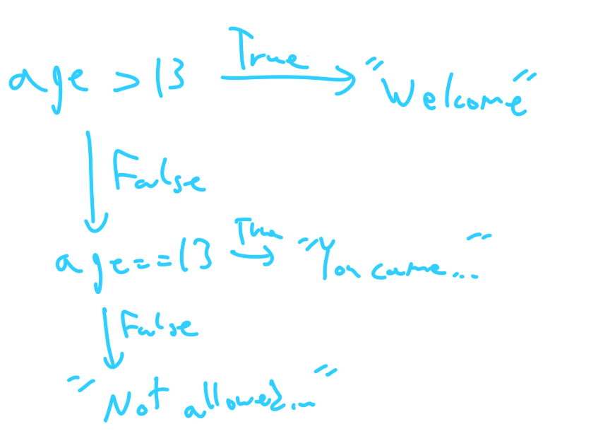

<figcaption>Author: Amr Ojjeh</figcaption>
<figcaption>Cover By: Amr Ojjeh</figcaption>
<figcaption>Last updated: June 2, 2021</figcaption>

# Intro to Python, Part Two

If you've not read the previous article, I encourage you to go [back](index.html) and read it.

So far, the programs we've written have been very straightforward. Regardless of the input, the same code was to be executed. However, most of the programs we'd like to write are not this simple.

## If Statement

Say we're developing a website, and we want to check the user's age to validate whether or not they are above 13 years old. Of course, this system is commonly cheated, but nonetheless, it makes a simple example of the if statement. Here's how we'd do that:

	:::python
	age = int(input("How old are you? "))
	if age >= 13:
		print("Welcome!")
	if age < 13:
		print("You're not allowed to sign up! But feel free to come back when you're older :)")

I won't go too much into the formal syntax, since this should be easy to understand on its own. If the given age is greater than *or equal to* 13, `>=`, we print "Welcome!". Note the indendation, this is telling Python that this line only runs if the if statement is true.

After it executes that, it runs the next if statement. You might've realized by now that if the first if statement is false, then the second is guaranteed to be true (if it's not greater than or equal to 13, then it can only be smaller). Similarly, if the second statement is true, then the first one must've been false. In cases like this, you can simplify the code and write:

	:::python
	if age >= 13:
		print("Welcome!")
	else:
		print("You're not allowed to sign up! But feel free to come back when you're older :)")

You can go further, and chain if statements using "else if" statements, called `elif` in Python.

	::python
	if age > 13:
		print("Welcome!")
	elif age == 13:
		print("You came back for us!")
	else:
		print("You're not allowed to sign up! But feel free to come back when you're older :)")

<figcaption>Here's the logic of the program in a flow chart form</figcaption>

For the `elif` and `else` branch to even be considered, the `if` branch **must** be false. And for the `else` branch to run, both the `if` and the `elif` **must** be false.

You can continue the chain and add as many `elif` statements as you please.

	::python
	if name == "Amr":
		print("Welcome President!")
		print("Because you're special, can I have your lucky number?")
		input("Pretty please? ")
		print("Thanks! I'll be sure to use it") # He doesn't use it
	elif name == "Talida":
		print("Welcome Vice President!")
	elif name == "Hagar":
		print("Welcome Secretary!")
	elif name == "Catherine":
		print("Welcome Social Media Officer!")
	else:
		print("Welcome " + name + "!")
	print("How are you doing?")
<figcaption>The "#" character means that anything after is a comment. Comments are ignored by the program.</figcaption>

I assume there are some questions going through your head. What's `int` and what does it do? Why do we use `==` to compare things? If the if statement still seems like magic, then don't worry, all these questions will be covered next article, when we go over data types. For now, I recommend you simply focus on the patterns.

## Exercise
Write a program which prints your letter grade given the class score.
