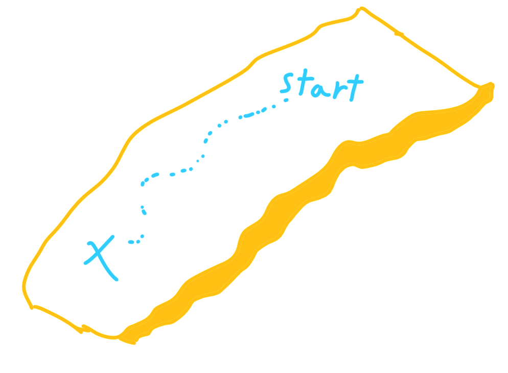

# How should I start?

Hello folks! Firstly, I want to announce, that in the last week alone, we've had 29 new students enroll in our club! I want to thank the student life for making this possible, and the CyFair students for their willingness to try something new. Prior to that week, including the officers and I, we had 39 students in the server, at least 16 of whom were active at one point or another. I asked for an active community, and that is what I'm getting. I'm grateful for it, and I'll be making sure I do my part until the last day of the semester.

As I've promised, this club will be welcoming to people, regardless of their skill level, As such, this article will be for anyone who has no experience with programming but wants to get started.

Specifically, I'll be addressing these questions:

* What's a programming language? (TL;DR a specific way to tell the computer what to do)

* Which language should I program in? (TL;DR Python, but read more if you're curious about other options)

* Which videos/books/sites should I follow? (TL;DR Depends on the language)

* How do I practice programming? (TL;DR Games, coding challenges, standard applications, etc.. Read more for specific ideas.)

## What's a Programming Language?

In the computer world, there are two parts. There is hardware, and there is software. You can literally throw your hardware out the window, because all hardware has mass. It's your case, monitor, graphics card, CPU, anything that you can touch. That said, please don't try throwing anything out your window.

On the other hand, software is (mostly) everything else, that is your operating system, this website, all the programs you've installed, and so on. Electrical engineers specialize with hardware, computer scientists specialize in software, and computer engineers specialize in their overlap. Very often, electrical engineers don't work alone when developing hardware, but work with computer sciensts and computer engineers as well.

Now, you likely already have a computer, and the computer has all the hardware it needs. How do you tell it what to do? That is, in essence what the job of a programming *language* is; to communicate with a computer. I won't talk in depth about how that occurs, especially since that varies with each language. Instead, I'll provide you with examples and enough simple details so that you know which language is best for you. If you choose to stick with it, you will eventually learn how the language itself works.

## Which Language Should I Program In?

As mentioned in the TL;DR above, if in doubt, go with Python. It's by far the easiest to understand and program in. Plus, even it doesn't end up being the most fitting for you, a lot of programming knowledge can be transferred when transitioning to another language. And if you program for long enough, you'll likely learn every single language listed below in time. With that said, more on how to learn Python in the next section.

However, if you want to consider starting in other languages, here's your guide for that. If you want to:

* take CS classes at CyFair: C++, then Java

* learn the interworkings of a computer: C (not to be confused with C++)

* write games: more on that next paragraph

* learn cybersecurity: Python *and* C

* write websites: Javascript (with HTML and CSS)

* share *code* easily: Python

* share *programs* easily: C++

* share *both* easily: Javascript

Ok, let's talk about game development. Most games are written using a game engine. You might've heard of Unity, Unreal Engine, CryEngine, Frostbite, and so on. Their logos will usually appear at the start of a game. Using a game engine, is the most practical and sane way of writing a game, as without one, a lot more months, if not years of work, would need to go into developing the most generic of game, and I am not exaggerating. So, if you plan to use a game engine, I advise you to do your research, pick your engine, then learn the langauge the engine is using *before* you use the engine. As a brief rundown:

* Unity uses C#

* Unreal uses C++

* Godot uses GDScript, which is very similar to Python (it can also use C# and C++, but because they're less used in Godot, learning Godot with C# or C++ can be more challenging)

Personally, I found Godot to be the most user friendly, but regardless, if this is the route you wish to pursue, learn the language of the engine you plan to go with, and learn it before you use the engine. It will make your life much easier in the long run.

If you do not plan to use a game engine, you really only need a language which can run fast. Python won't do the trick, but languages like C++ and C# are battleground tested for this sort of thing. Celeste, for example, was made using C# without a game engine (they used Monogame, which is a library). Do note, however, that if you're going to make a game without an engine, that usually means you'll have to write a lot of your own tools and libraries, effectively making your own game engine. That is why C++ and C# make effective languages for this option, because they are in fact used to write game engines themselves.

## Which videos/books/sites should I follow?

Before I share any resources, a word of caution regarding videos. They can be very easy to binge. That can be good, but often what will end up happen is, you'll finish a whole playlist and think you've learned a ton, but by the time you work on your first project, you'll realize how little in fact you've retained. This is simply due to a lack of practice, which we'll talk more about in the next section.

Another note, you'll find that some people use different programs than others. That's fine, the tools each person uses is completely irrelevant to your understanding of the langauge. Keep that in mind as you learn, and if you have a question regarding a tool someone uses, feel free to message me. For now, here are the resources I'll be recommending (feel free to mix and match, but **focus on one language!**)

For Python:

* [Derek Banas](https://www.youtube.com/watch?v=nwjAHQERL08) teaches Python by covering material then testing you on it right after. It's one way to mitigate the binging problem stated earlier, which is why I recommend him.

* [Corey Schafer](https://www.youtube.com/playlist?list=PL-osiE80TeTskrapNbzXhwoFUiLCjGgY7) also does a great job teaching, although I don't recall him having practice problems. Regardless, his explanations are really good, so I have him listed here.

* If you prefer books to videos, while I've not read it myself, I've heard great things about [Automate the Boring Stuff With Python](https://automatetheboringstuff.com/). The book is completely free online, and also provides the option of a physical copy, which you can buy from their [site](https://nostarch.com/automatestuff2) or [Amazon](https://www.amazon.com/Automate-Boring-Stuff-Python-2nd/dp/1593279922) (if you buy from their site, you get the PDF as well).

* And of course, the official website of [Python](https://wiki.python.org/moin/BeginnersGuide), which links to other resources, and even lets you learn Python completely on the web without installing anything.

For C++:

* [Cherno](https://www.youtube.com/watch?v=18c3MTX0PK0&list=PLlrATfBNZ98dudnM48yfGUldqGD0S4FFb&index=1), who used to work at EA as a game engine programmer, is an excellent teacher and programmer. Many times he'll go under the hood and show what the computer is actually doing. He also has a series where he develops a game engine from the bottom up.

* [Javidx9](https://www.youtube.com/watch?v=E7CxMHsYzSs) takes another approach, which is by writing and explaining many small C++ projects, allowing for a great opportunity for someone to practice implementing the projects which he implements, or to take them further and improve upon them. He uses his own library to allow for very easy rendering on the console.

* If you want a book, unfortunately, I don't know which one to recommend. Personally, I read [Tour of C++](https://www.amazon.com/Bjarne-Stroustrupand-Depth-Addison-Wesley-Professional/dp/B07VKBLS4Y/), written by the author of the language, but it's definitely not for beginners, even though it's a great book.

I'll be adding resources here for Java or C# or a game engine if they're requested enough. I'm getting exhausted!

## How Do I Practice Programming?

You have the videos, the books, the articles, now how do you practice? Well, if any of these things have practice built into them, then that's awesome. If not, here's what I recommend:

* if you would like to solve small CS or computational problems: [Project Euler](https://projecteuler.net/archives) or [HackerRank](https://www.hackerrank.com/) make good websites. 

* If you wish to see common problems solved in a language of your choosing: [Rosetta Code](https://www.rosettacode.org/wiki/Rosetta_Code).

* If you would like to work on a slightly bigger project: Write a small game such as tic tac toe, snake, soduku logical checker, hangman, text adventure, etc...

* Follow along these articles! I'll be writing about interesting algorithms, and I recommend you try to implement them.

* Going with the spirit of the book mentioned earlier, automate the boring stuff. Try fun things, like downloading cat images until its told to stop, or make discord bots which kicks anyone with the name "Amr," or write a tournament tracking system. Anything you can think of, even if you don't _need_ it, write it for the sake of practice.

* Finally, if you're feeling confident, tackle on a big project. Make an RPG, or your personal website, anything that you can put your all-in into.

As a final word of advice, do not go into any project or challenge expecting that you have to solve them or finish them. The point of practice is that you learn what you're capable of, and how you can learn more. I've listed all these resources as a start for y'all, but I personally had to go through many trials and errors to find these resources, as I've learned how to ask questions and where to find their answers. Regardless of how many more resources I list here, you will have to go through the same phase of learning I went through, as you'll encuonter your own unique problems, and technology is inevitably going to change and the materials here will become out of date.

With that said, I hope I've provided plenty! You get in what you put out, so it's going to take a time investment. Good luck on your adventures!

---

